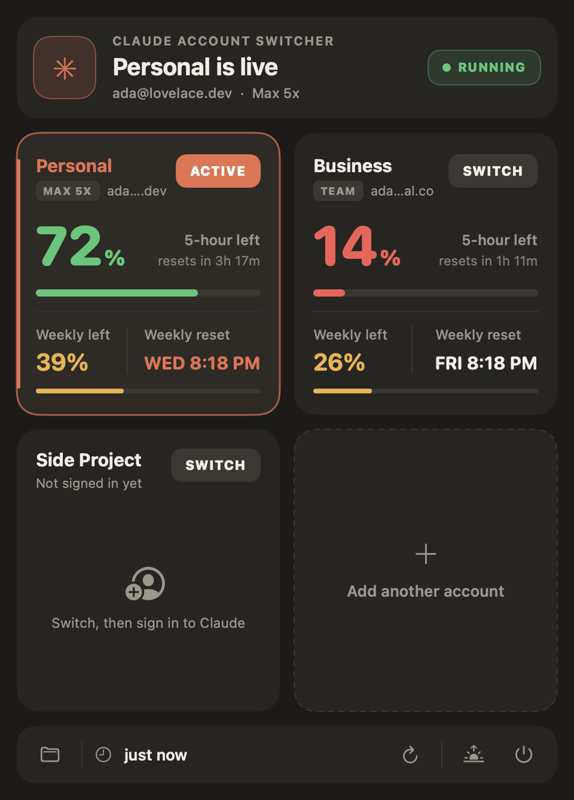

# Claude Switcher

A tiny macOS menu bar app for people with more than one Claude account (say, Personal and Business). One click swaps the Claude desktop app between accounts, and a panel shows how much usage each account has left before you pick one.

<p align="center"></p>

## What it does

- **Switch accounts in one click.** Each account keeps its own login, settings and Claude Code threads. No signing out and back in.
- **See your limits at a glance.** For every account: 5-hour session left, weekly limit left, and when each one resets.
- **Menu bar readout.** The icon shows the active account and its remaining session, e.g. `✦ P · 72%`.
- **Add as many accounts as you like.** Click "Add another account", give it a name, switch to it and sign in.
- **Open at login.** Toggle it with the sunrise button in the footer.

## Install

Requires macOS 13+ and the Xcode Command Line Tools (`xcode-select --install`).

```sh
git clone https://github.com/l2succes/claude-switcher.git
cd claude-switcher
./build.sh install
```

That builds the app, copies it to `/Applications`, adds it to Login Items and launches it. Use `./build.sh` on its own to just build it in place.

The first time it reads usage, macOS asks whether **Claude Switcher** may access **Claude Safe Storage** in your keychain. Click **Always Allow** (see [How usage works](#how-usage-works) for why).

## How switching works

Claude Desktop keeps everything (login, cookies, threads) in `~/Library/Application Support/Claude`. Claude Switcher keeps the inactive accounts next to it:

```
~/Library/Application Support/
├── Claude/                 ← whichever account is active
└── Claude-Profiles/
    ├── Business/           ← parked accounts
    ├── .current            ← name of the active one
    └── .cache/             ← last-known usage per account
```

Switching quits Claude, renames the folders (instant, even for many GB) and reopens Claude. A new account starts as an empty folder, so Claude opens signed out and you log in once.

Safety rails: if Claude doesn't quit within 15 seconds, nothing is moved. It never overwrites a parked profile that has data in it.

## How usage works

Claude Desktop stores each account's login token in that account's `config.json`, encrypted with a key in your macOS keychain. Claude Switcher decrypts the token locally and calls the same usage endpoint the Claude apps use (`api.anthropic.com/api/oauth/usage`). Tokens never leave your Mac except in requests to `api.anthropic.com`. Usage refreshes when you open the panel and every 5 minutes.

## Caveats

- **Unofficial.** This isn't made by or affiliated with Anthropic. The usage endpoint is undocumented and could change; if it does, cards fall back to the last known numbers ("as of 2h ago").
- **Desktop app only.** The `claude` CLI has its own login and isn't switched.
- **Switching quits Claude.** Let running sessions finish first.
- Claude Code transcripts live in the shared `~/.claude/projects`. Only the desktop thread lists are split per account.
- The app is ad-hoc signed, so after rebuilding you'll get the keychain prompt again.

## Uninstall

Quit it from the panel (power button), turn off "open at login" first if you enabled it, then delete `/Applications/Claude Switcher.app`. To merge back to one account, switch to the one you want to keep and delete `~/Library/Application Support/Claude-Profiles`.

## Development

Everything is in [`main.swift`](main.swift) (SwiftUI in an `NSPopover`, no Xcode project). To regenerate the screenshot with fake data:

```sh
./build.sh && "./Claude Switcher.app/Contents/MacOS/ClaudeSwitcher" --snapshot docs/panel.png --demo
```

## License

MIT
